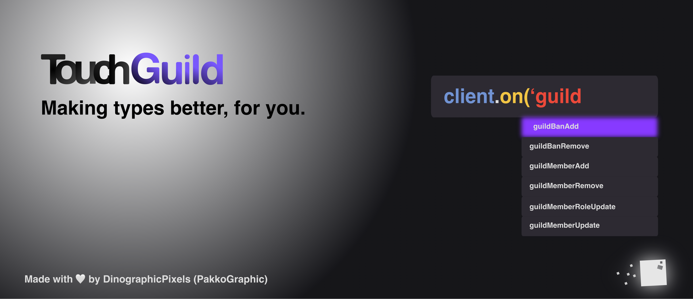

# 🌟 Get started

<figure><figcaption></figcaption></figure>

## Get started, it's easy.

You'll need to download Node (npm), sorry yarn users but it's not for now.

### Install the package

```bash
npm install touchguild@latest
```

### Basic scripting (ping, pong!)

Let's get started, it'll be easy examples for ya!

For example, we'll create a simple ping pong script, a well known command!

Javascript & Typescript:

```javascript
const TouchGuild = require('touchguild') // import for CommonJS
// import * as TouchGuild from 'TouchGuild' // import for ESM & TS

const Client = new TouchGuild.Client({token: 'insert token here'}) // create client

Client.connect();

Client.on('messageCreate', (message)=> {
    // Detects when a message is created and executes the code here.
    if (message.member.bot == true) return; // ignores bot messages.
    if (message.content == '!ping'){
        // if the message command is !ping, it executes the code here.
        message.createMessage({content: 'pong!'}); // create a message.
    }
});
```


Note: CommonJS, ESM & Typescript are supported.


### Need to get new features, right. Now?

You can get new features before the stable release.

Install Nighly builds via NPM:

```bash
npm install dinographicpixels/touchguild#nightly
```


Be aware that Nightly builds aren't stable and can have still have major bugs. If you face issues, feel free to report it by creating an issue on TouchGuild's GitHub, please specify that you're using a Nightly build.



You can check [Nightly Features here.](nightly/features.md)

