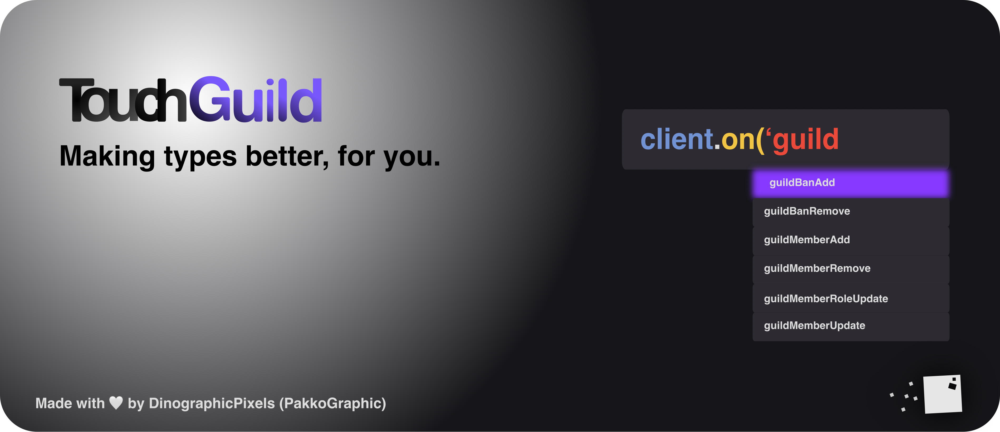

# 🌟 Get started

<figure><figcaption></figcaption></figure>

## Installation

NodeJS **16.16.0** or higher is required

```bash
npm install touchguild@latest
```

## Get started

```javascript
const TouchGuild = require('touchguild'); // import for CommonJS
// import * as TouchGuild from 'touchguild' // import for ESM & TS

const client = new TouchGuild.Client({token: 'insert token here'});

client.on('ready', ()=> {
   console.log("I'm ready!");
});

client.on('error', ()=> {
   console.error("Whoops, somethin' went wrong..");
});

client.connect();
```


Note: CommonJS, ESM & Typescript are supported.


## Nightly builds

Nightly builds are pre-release builds, they're having new features in real time. Once there's enough features, we're releasing them as a brand new 'stable build'.

<figure><figcaption></figcaption></figure>

### Need to get new features, right. Now?

You can get new features before the stable release.

#### Install the latest Nightly build through NPM:

```bash
npm install touchguild@nightly
```

#### Install the latest Nightly build through GitHub using NPM:

```bash
npm install dinographicpixels/touchguild#nightly
```


Be aware that Nightly builds aren't stable and can have still have major bugs. If you face issues, feel free to report it by creating an issue on TouchGuild's GitHub, please specify that you're using a Nightly build.



You can check [Nightly Features here.](nightly/features.md)


## LINKS:

#### Repository & NPM

* [NPM Package](https://www.npmjs.com/package/touchguild)
* [GitHub](https://github.com/DinographicPixels/TouchGuild)

#### Guide & documentation

* [Guide](https://docs.touchguild.dinographicpixels.com/guide/get-started)
* [Documentation](https://docs.touchguild.dinographicpixels.com/documentation/home)

#### Additional links

* [Our vision of the project](https://docs.touchguild.dinographicpixels.com/misc/our-vision)
* [FAQ](https://docs.touchguild.dinographicpixels.com/misc/faq)
* [Get started, youtube video](https://www.youtube.com/watch?v=AUaiQRMjJZo)

#### Our servers

* [Our Discord server](https://discord.gg/UgPRaGRkrQ)
* [Our Guilded server](https://www.guilded.gg/i/ExPXPrwE)
